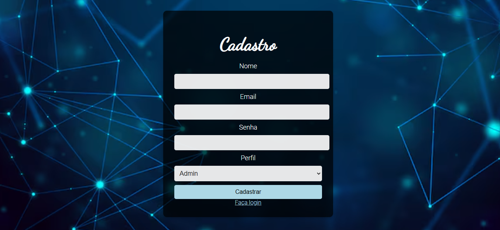
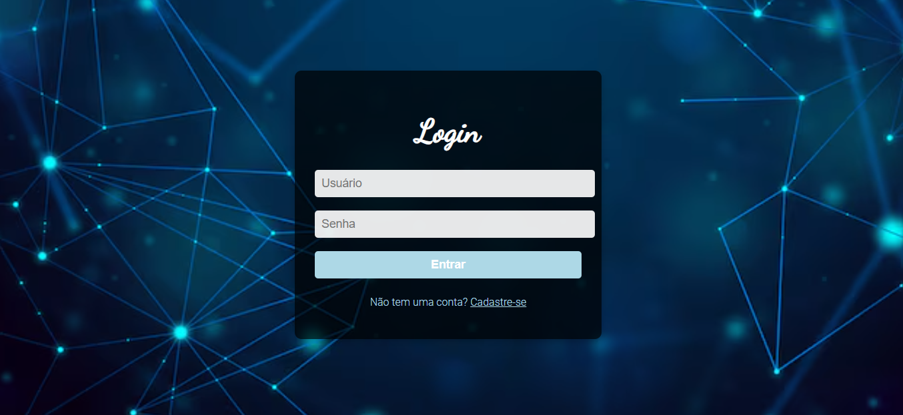
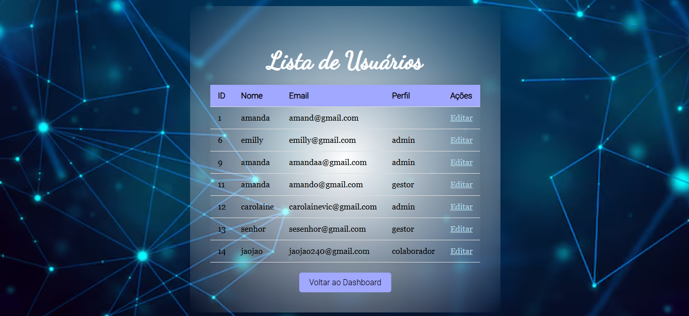

# CadLogin-System

## Descrição 
 Fizemos a Criação de um sistema de cadastro e login que terá 3 tipos de usuarios ADIM, GESTOR e COLABORADOR. Nesse trabalho junto com o professor em sala realizamos a criação do codigo dessas páginas e a ligação com banco de dados.

## Tela de Cadastro

## Tela de Login

## Tela Inicial Colaborador

## Tela Inicial Admin
 

## Tela Inicial Gestor

## Lista de usuário

## CSS:
Adicionei cor de fundo com um degrade e utilizei a ferramenta css-gradeent.
Adicionei borda.
Aumentei as caixas de texto.
Alteração nas fontes.
Sombriado colorido nas caixas de texto e botão

## Fontes utilizadas
- CSS  
- HTML.5  
- PhpmyAdmin  
- GitHub  
